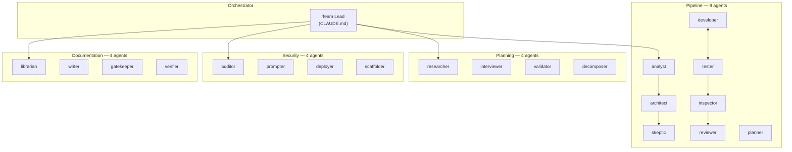
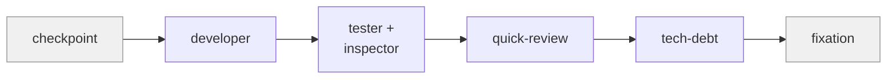
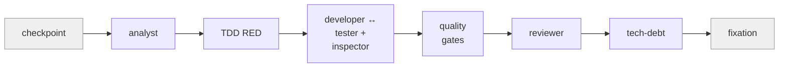
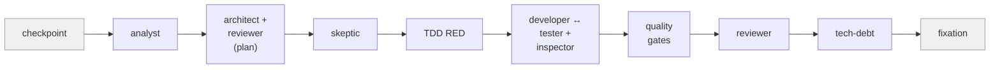
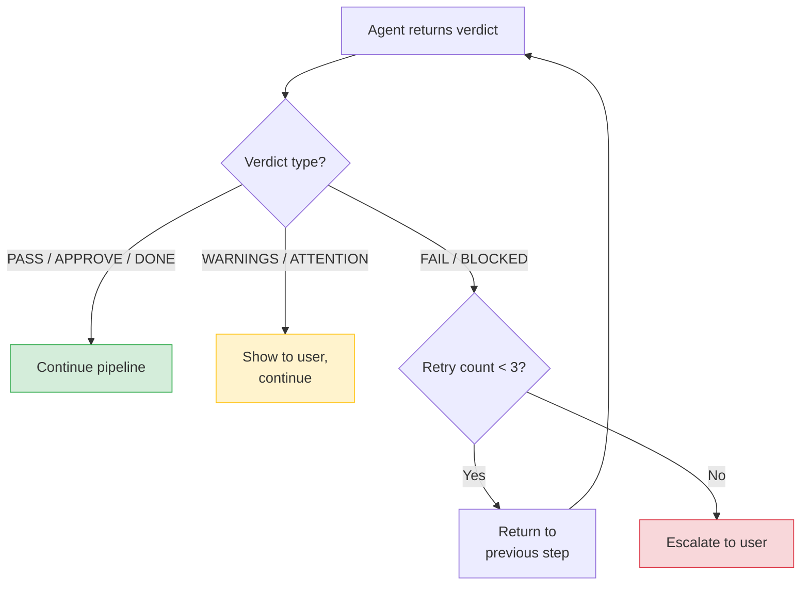
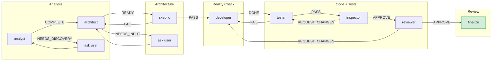
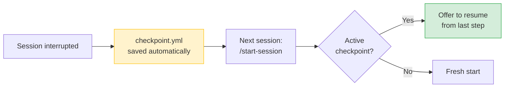

# agent-forge

AI-driven Development Framework for Claude Code. Generates a complete development infrastructure with 20 specialized agents, quality gates, and TDD pipelines.

[](https://www.npmjs.com/package/@alxyrgin/agent-forge)
[](https://github.com/alxyrgin/agent-forge/blob/main/LICENSE)
[](https://nodejs.org)

## Quick Start

```bash
npx @alxyrgin/agent-forge init
```

The interactive wizard asks for your project name, tech stack, team, and agent preset — then scaffolds the entire AI infrastructure in seconds. Start working immediately with `/start-session`.

```bash
npx @alxyrgin/agent-forge init --yes   # non-interactive, use defaults
```

## What Gets Generated

| Directory | Contents |
|-----------|----------|
| `.claude/CLAUDE.md` | Team Lead instructions — the orchestrator prompt |
| `.claude/agents/` | 5–20 specialized agents across 4 categories |
| `.claude/skills/` | 10–21 slash commands for development workflows |
| `.claude/rules/` | 8 development standards enforced automatically |
| `.claude/hooks/` | Git/tool hooks (protect-docs, stop hook) |
| `dev-infra/memory/` | 9 Memory Bank files for persistent context |
| `dev-infra/tasks/` | Task tracking system (`tasks.json`) |
| `dev-infra/sessions/` | Session logs |
| `dev-infra/tests/` | Test structure (acceptance criteria, PMI scenarios, results) |

## Architecture

The Team Lead (defined in `CLAUDE.md`) orchestrates four categories of specialized agents:



Each agent has a defined role, a set of allowed tools, a model assignment, and structured JSON output with verdicts. The Team Lead reads each verdict and routes the pipeline accordingly.

## Pipelines

Every task is classified by size — **S**, **M**, or **L** — and routed through the appropriate pipeline. Larger tasks get more validation steps.

### S-Pipeline. Small tasks (1 file, < 50 lines)



### M-Pipeline. Medium tasks (2–5 files, new module)



### L-Pipeline. Large tasks (6+ files, architecture changes)



Key pipeline features:
- **TDD RED phase** (M/L) — tester writes failing tests *before* developer writes code
- **Per-feature loops** (L) — developer and tester iterate on each feature independently
- **Inspector gate** — validates test quality after tester, before reviewer
- **Multi-round review** — reviewer runs up to 3 rounds; CRITICAL/HIGH issues go back to developer
- **Tech-debt is mandatory** for all sizes — never skipped

## Agent Presets

Three presets control how many agents are scaffolded:

| Preset | Agents | Skills | Best for |
|--------|--------|--------|----------|
| **minimal** | 5 | 10 | Solo developer, small projects |
| **core** (default) | 8 | 10 | Teams, production projects |
| **full** | 20 | 21 | Complex systems, enterprise |

### Preset coverage

| Agent | minimal | core | full |
|-------|:-------:|:----:|:----:|
| analyst | x | x | x |
| architect | | x | x |
| skeptic | | x | x |
| developer | x | x | x |
| tester | x | x | x |
| inspector | x | x | x |
| reviewer | x | x | x |
| planner | | x | x |
| researcher | | | x |
| interviewer | | | x |
| validator | | | x |
| decomposer | | | x |
| auditor | | | x |
| prompter | | | x |
| deployer | | | x |
| scaffolder | | | x |
| librarian | | | x |
| writer | | | x |
| gatekeeper | | | x |
| verifier | | | x |

## Agents

### Pipeline (8 agents)

Core development cycle — from analysis to code review.

| Agent | Description | Verdicts |
|-------|-------------|----------|
| **analyst** | Analyzes task requirements from documentation, extracts acceptance criteria and PMI scenarios | `COMPLETE`, `NEEDS_DISCOVERY` |
| **architect** | Designs module architecture — structure, API contracts, data schemas | `READY`, `NEEDS_INPUT` |
| **skeptic** | Reality checker — verifies plans against actual codebase, finds "mirages" (non-existent files, APIs, modules) | `PASS`, `PASS_WITH_WARNINGS`, `FAIL` |
| **developer** | Writes code following project patterns, makes failing TDD tests green | `DONE`, `BLOCKED` |
| **tester** | Parametric testing agent — unit, integration, acceptance, smoke. Supports TDD mode | `PASS`, `FAIL` |
| **inspector** | Validates test quality — coverage, naming, assertions, mocking, isolation, edge cases | `APPROVE`, `REQUEST_CHANGES` |
| **reviewer** | Code review with iterations and escalation. Modes: default, plan_review, quick | `APPROVE`, `REQUEST_CHANGES`, `ESCALATE` |
| **planner** | Project-level planning — milestones, tasks, dependencies, completeness validation | `VALID`, `ISSUES_FOUND` |

### Planning (4 agents)

Deep analysis and task decomposition. Available in the **full** preset.

| Agent | Description |
|-------|-------------|
| **researcher** | Codebase exploration — entry points, patterns, dependencies, integrations |
| **interviewer** | Structured discovery interview — 3 cycles (general, code-informed, edge cases) |
| **validator** | Specification validation — 4 modes: userspec, techspec, task, completeness |
| **decomposer** | Task decomposition — generates atomic tasks with TDD anchors, acceptance criteria, and verify steps |

### Security (4 agents)

Security audits and infrastructure review. Available in the **full** preset.

| Agent | Description |
|-------|-------------|
| **auditor** | Security analysis — OWASP Top 10, hardcoded secrets, threat modeling, access control |
| **prompter** | LLM prompt review — clarity, few-shot quality, output format, injection safety, token efficiency |
| **deployer** | CI/CD review — workflow correctness, secrets management, platform config, deploy scripts |
| **scaffolder** | Project infrastructure review — structure, Docker, pre-commit hooks, .gitignore, dependency management |

### Documentation (4 agents)

Documentation quality and deployment validation. Available in the **full** preset.

| Agent | Description |
|-------|-------------|
| **librarian** | Documentation review — completeness, freshness, absence of bloat, consistency |
| **writer** | Generates stakeholder-facing reports and internal documentation |
| **gatekeeper** | Pre-deploy QA — runs tests, verifies acceptance criteria, checks deferred criteria |
| **verifier** | Post-deploy QA — live environment verification, manual verification plans |

## Skills (Slash Commands)

### Core skills (all presets) — 10 commands

| Command | Description |
|---------|-------------|
| `/start-session` | Begin work — sync repo, check checkpoint, load context, show progress |
| `/end-session` | Save context, checkpoint, create session log, commit and push |
| `/take-task [id]` | Full development cycle with feature-size routing (S/M/L) |
| `/complete-task [id]` | Verify task, smoke test, update progress, clear checkpoint |
| `/status` | Show project status, deadlines, blockers |
| `/plan [mode]` | Plan, replan, or validate tasks from documentation |
| `/review [file]` | Code review for a file or task |
| `/code [task]` | Direct code generation for a specific task |
| `/test [target]` | Run or generate tests for a target |
| `/done [id]` | Quick-complete a task with minimal ceremony |

### Extra skills (full preset only) — 11 commands

| Command | Description |
|---------|-------------|
| `/interview` | Structured discovery interview (3 cycles, completeness >= 85%) |
| `/audit-wave` | Comprehensive pre-milestone audit with GO/NO-GO verdict |
| `/write-report` | Generate non-technical progress report for stakeholders |
| `/dashboard` | Project dashboard — progress, health, tech debt, activity |
| `/skill-master [name]` | Create a new custom skill from template |
| `/decompose [task]` | Break down a task into subtasks with TDD anchors |
| `/feature [name]` | Scaffold a new feature end-to-end |
| `/security [target]` | Run security analysis on a target |
| `/spec [feature]` | Generate specification for a feature |
| `/techspec [module]` | Generate technical specification for a module |
| `/prompts [agent]` | Manage and optimize agent prompts |

## Rules

8 development standards that are loaded automatically and enforced across all agents:

| Rule | Purpose |
|------|---------|
| `commit-conventions` | Commit message format — `[type](scope): description` |
| `development-cycle` | Feature-size routing (S/M/L) and pipeline step definitions |
| `testing-standards` | Test coverage >= 80%, edge cases, access control testing |
| `shared-resources` | Singleton resource registry — no duplicate DB connections or API clients |
| `context-loading` | Just-in-time context loading — pass data, not file references |
| `agent-output-format` | JSON output standard for all agents with structured verdicts |
| `quality-gates` | Verdict-based routing between pipeline steps |
| `rollback-protocol` | Rollback procedures for failed deployments |

## Quality Gates

Every agent returns a structured verdict. The Team Lead reads the verdict and routes the pipeline:



### Verdict matrix



## CLI Commands

### `agent-forge init`

Initialize AI-driven development infrastructure in the current directory.

```bash
npx @alxyrgin/agent-forge init           # interactive setup
npx @alxyrgin/agent-forge init --yes     # use defaults (TypeScript, core preset)
npx @alxyrgin/agent-forge init --overwrite  # overwrite existing files
```

The wizard prompts for:
- Project name and description
- Technology stack (Python / TypeScript / Go / Rust)
- Framework and test framework
- Team members (names, roles, emails)
- Milestones (optional)
- Agent preset (minimal / core / full)
- Commit style (standard / conventional)

### `agent-forge update`

Update framework files while preserving your data.

```bash
npx @alxyrgin/agent-forge update
```

**Overwritten** (updated to latest version):
- `.claude/CLAUDE.md`
- `.claude/agents/*`
- `.claude/skills/*`
- `.claude/rules/*`
- `.claude/hooks/*`
- `.claude/settings.json`

**Preserved** (your data stays intact):
- `dev-infra/memory/*` — your Memory Bank
- `dev-infra/tasks/*` — your task tracking
- `dev-infra/sessions/*` — your session logs
- `dev-infra/tests/*` — your test structure

### `agent-forge doctor`

Check integrity of the generated structure. Verifies that all expected files exist and are not empty.

```bash
npx @alxyrgin/agent-forge doctor
```

## Memory Bank

9 files that persist context across sessions. The Team Lead reads and updates these automatically.

| File | Purpose |
|------|---------|
| `active-context.md` | Current session state — what is done, what is next |
| `progress.md` | Milestone progress, task statuses |
| `project-brief.md` | Project overview, team, stack |
| `decisions.md` | Architectural Decision Records (ADR) |
| `tech-stack.md` | Technology stack details |
| `tech-debt.md` | Technical debt registry with lifecycle tracking (open / in_progress / resolved) |
| `patterns.md` | Code patterns and conventions |
| `troubleshooting.md` | Problem solutions log |
| `checkpoint.yml` | Recovery checkpoint for interrupted sessions |

### Checkpoint System

The checkpoint (`dev-infra/memory/checkpoint.yml`) enables recovery after session interruptions:

- **Automatic saving** — updated after each pipeline step
- **Recovery on start** — `/start-session` detects an active checkpoint and offers to resume
- **Cleanup on completion** — `/complete-task` clears the checkpoint



## Generated Structure

```
your-project/
├── .claude/
│   ├── CLAUDE.md                  # Team Lead instructions
│   ├── settings.json              # Claude Code hooks and env
│   ├── hooks/
│   │   └── protect-docs.sh        # PreToolUse hook — blocks edits in docs/
│   ├── agents/
│   │   ├── pipeline/              # analyst, architect, skeptic, developer,
│   │   │                          # tester, inspector, reviewer, planner
│   │   ├── planning/              # researcher, validator, interviewer, decomposer
│   │   ├── security/              # auditor, prompter, deployer, scaffolder
│   │   └── documentation/         # librarian, writer, gatekeeper, verifier
│   ├── skills/
│   │   ├── start-session/SKILL.md
│   │   ├── take-task/SKILL.md
│   │   ├── code/SKILL.md
│   │   ├── test/SKILL.md
│   │   └── ...                    # 10–21 slash commands
│   └── rules/
│       ├── commit-conventions.md
│       ├── development-cycle.md
│       ├── testing-standards.md
│       ├── shared-resources.md
│       ├── context-loading.md
│       ├── agent-output-format.md
│       ├── quality-gates.md
│       └── rollback-protocol.md
├── dev-infra/
│   ├── memory/                    # 9 Memory Bank files
│   │   ├── active-context.md
│   │   ├── progress.md
│   │   ├── checkpoint.yml
│   │   └── ...
│   ├── tasks/
│   │   └── tasks.json             # Task tracking
│   ├── sessions/                  # Session logs
│   └── tests/
│       ├── acceptance/            # Acceptance criteria
│       ├── pmi/                   # PMI scenarios
│       └── results/               # Test results
└── .claude-forge.json             # Manifest for doctor and update
```

## License

MIT
